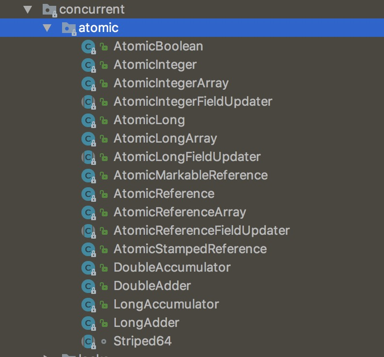

# java 自旋锁

首先是一种非阻塞锁。

应用场景：如果两个线程资源竞争不是特别激烈，而处理器阻塞一个线程引起的线程上下文的切换的代价高于等待资源的代价的时候（锁的已保持者保持锁时间比较短），那么线程B可以不放弃CPU时间片，而是在“原地”忙等，直到锁的持有者释放了该锁。

### 自旋锁存在的问题
- ***过多占据CPU时间：*** 如果锁的当前持有者长时间不释放该锁，那么等待者将长时间的占据cpu时间片，导致CPU资源的浪费，因此可以设定一个时间，当锁持有者超过这个时间不释放锁时，等待者会放弃CPU时间片阻塞。
- ***死锁问题***试想一下，有一个线程连续两次试图获得自旋锁（比如在递归程序中），第一次这个线程获得了该锁，当第二次试图加锁的时候，检测到锁已被占用（其实是被自己占用），那么这时，线程会一直等待自己释放该锁，而不能继续执行，这样就引起了死锁。因此递归程序使用自旋锁应该遵循以下原则：递归程序决不能在持有自旋锁时调用它自己，也决不能在递归调用时试图获得相同的自旋锁。
- ***aba问题：*** java中自旋锁一般是利用CAS（compare And set）操作实现。（虽然结果没变，但是中间的确发生了一些东西。）

### 实现原理

可以查看包下的文件：
<br>


AtomicBoolean 的部分实现代码如下
```java
private static final Unsafe unsafe = Unsafe.getUnsafe();
    private static final long valueOffset;

    static {
        try {
            valueOffset = unsafe.objectFieldOffset
                (AtomicBoolean.class.getDeclaredField("value"));
        } catch (Exception ex) { throw new Error(ex); }
    }
```

java 自旋实现

```java
public class SpinLock {

  private AtomicReference<Thread> sign =new AtomicReference<>();

  public void lock(){
    Thread current = Thread.currentThread();
    while(!sign .compareAndSet(null, current)){
    }
  }

  public void unlock (){
    Thread current = Thread.currentThread();
    sign .compareAndSet(current, null);
  }
}
```
[参考链接](http://www.jianshu.com/p/dfbe0ebfec95)
