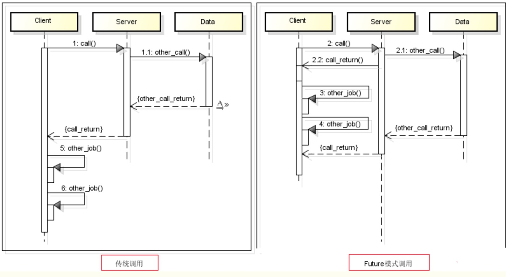
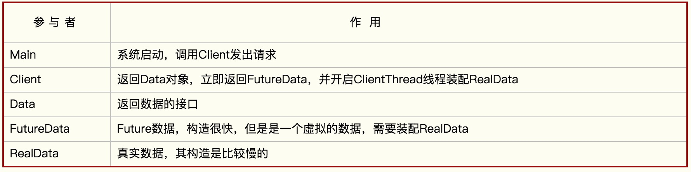

# future 模式

去除了主函数的等待时间，并使得原本需要等待的时间段可以用于处理其他业务逻辑。（异步）

Future 和传统的模式 的区别
<br>



主要的参与者如下：
<br>




#### main函数的实现：
Main函数主要负责调用Client发起请求，并使用返回的数据：

```java
public class Main {
    public static void main(String[] args) {
        Client client = new Client();
        // 这里会立即返回，因为获取的是FutureData，而非RealData
        Data data = client.request("name");

        try {
            //do otherthing
            // 获取真实的数据
            System.out.println("数据=" + data.getResult());
        } catch (InterruptedException e) {
            e.printStackTrace();
        }
    }
}
```
#### client 的实现：
Client主要实现了获取futrueData，开启构造RealData的线程，并在接受请求后，很快地返回FutureData

```java
public class Client {
    public Data request(final String string) {
        final FutureData futureData = new FutureData();

        new Thread(new Runnable() {
            @Override
            public void run() {
                RealData realData = new RealData(string);
                futureData.setRealData(realData);
            }
        }).start();
        return futureData;
    }
}
```

#### Data 的实现

Data是一个接口，提供了getResult()方法。无论futureData或者RealData都实现了这个接口

```java
public interface Data {
    String getResult() throws InterruptedException;
}
```
