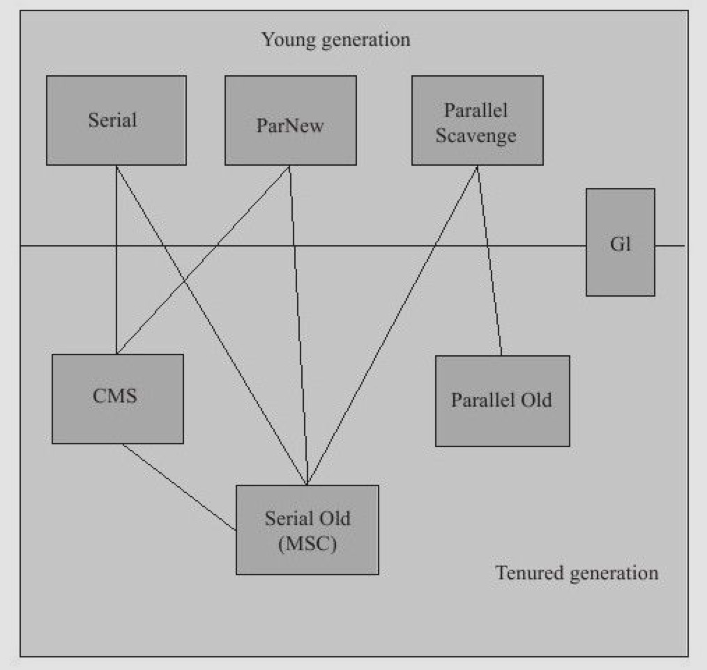

# CMS GC

CMS是并发收集器，作用于老年代。

-  CMS的目标是时间优先（最短停顿时间），如果你追求响应速度，那么可以选择该收集器。
-  CMS通常与ParNew配合使用。

搭配图如下：

#### CMS的过程

CMS是基于`标记-清除算法`实现的

步骤如下：

- 初始标记(initial-mark)：从GC Root开始，仅扫描与根节点直接关联的对象并标记，这个过程需要STW(stop the world)，但是GC Root数量有限，因此时间较短 .stop the world 意思是停下来 gc
- 并发标记(concurrent-marking)：这个阶段在初始标记的基础上继续向下进行遍历标记。这个阶段与用户线程并发执行，因此不停顿。
- 并发预清理(concurrent-precleaning)：上一阶段执行期间，会出现一些刚刚晋升老年代的对象，该阶段通过重新扫描减少下一阶段的工作。该阶段并发执行，不停顿。（就是重新扫描）
- 重新标记(remark)：重新标记阶段会对CMS堆上的对象进行扫描，以对并发标记阶段遭到破坏的对象引用关系进行修复，以保证执行清理之前对象引用关系是正确的。这一阶段需要STW，时间也比较短暂。
- 并发清理(concurrent-sweeping)：清理垃圾对象

初始化标记，重新标记  有stw .

#### CMS 的缺陷

- 由于CMS是基于 `标记-清理` 算法的，因此会产生大量的内存碎片。这很可能会出现老年代虽然有大量不连续的空闲内存，但很难找到连续的内存空间来给对象分配，不得不提前触发一次Full GC的情况。

 
针对这一点，CMS提供了一个
`-XX:+UseCMSCompactAtFullCollection`开关（默认开启）用于在CMS要over的时候进行内存碎片整理从而得到连续的内存空间。这样内存碎片的问题可以解决，但STW的时间也相应变长。

- CMS收集器无法处理 `浮动垃圾（Floating Garbage`，可能出现“Concurrent Mode Failure”失败而导致另一次Full GC的产生。由于CMS并发清理阶段用户线程还在运行着，伴随程序的运行自然还会有新的垃圾不断产生，这一部分垃圾出现在标记过程之后，CMS无法在本次收集中处理掉它们，只好留待下一次GC时再将其清理掉，这一部分垃圾就称为“浮动垃圾”。由于在垃圾收集阶段用户线程还需要运行，即还需要预留足够的内存空间给用户线程使用，因此CMS收集器不能像其他收集器那样等到老年代几乎完全被填满了再进行收集，需要预留一部分空间提供并发收集时的程序运作使用。在默认设置下，CMS收集器在老年代使用了92%的空间后就会被激活(JDK 1.6)。

 
可以通过设置`-XX:CMSInitiatingOccupancyFraction`的值来改变这个阈值。注意一定要结合实际的运行情况，不要设的太大，假如内存真的太满，CMS要gg的时候就会临时召唤出Serial Old对老年代进行Full GC，停顿时间长，因此一定要合理设置这个参数的值。

